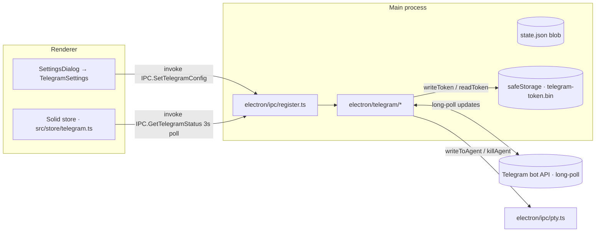

# Design — Telegram control

**Source of truth: [`openspec/changes/add-telegram-control/design.md`](../../../openspec/changes/add-telegram-control/design.md).**

The full design — module layout (`electron/telegram/*`), `grammy` library
choice, bot lifecycle, allowed-chat handshake, command router, agent
question detection, idle detection, agent exit handling, live tail and
rate limiting, MarkdownV2 escaping policy, Mini App `initData` verifier,
optional cloudflared tunnel, focus tracking, voice prompts, file uploads,
encrypted token storage via Electron `safeStorage`, persisted state shape,
Settings UI, IPC channels, error handling, audit log, persistence schema
version, and cross-platform notes — is in the OpenSpec design document
linked above.

## Slice 1 architecture (this branch)

`electron/telegram/` modules implemented in this slice:

- `types.ts` — `TelegramConfig`, `TelegramStatus`, `TelegramError`, `AuditEntry`
- `store.ts` — `safeStorage`-encrypted token + OpenAI key on disk
- `config.ts` — main-side cache of the renderer's non-secret config
- `integration.ts` — project/task cache populated by `SaveAppState` hook
- `focus.ts` — focused-agent id mirror for voice / reply-chain
- `audit.ts` — structured audit entry writer
- `formatter.ts` — ANSI strip, MD2 escape, last-N lines, code block
- `redact.ts` — baseline secret redactions + user patterns
- `bot.ts` — grammy lifecycle, 409 conflict, 403 auto-remove
- `commands.ts` — `/agents`, `/status`, `/prompt`, `/approve`, `/deny`, `/kill`, `/help`, `/start`
- `index.ts` — public entry consumed by `register.ts` and `main.ts`

## Slice boundaries

Modules referenced in the OpenSpec design but **not** implemented in this
slice (and the slice that ships them):

| Module                                            | Slice |
| ------------------------------------------------- | ----- |
| `detector.ts` (question detection)                | 2     |
| `idle.ts` (active → idle transitions)             | 2     |
| `reply.ts` (reply-chain routing LRU)              | 2     |
| `inline.ts` (inline keyboard callbacks)           | 2     |
| `ratelimit.ts` (token buckets + PTY backpressure) | 2     |
| `initdata.ts` (Mini App HMAC verifier)            | 3     |
| `tunnel.ts` (cloudflared auto-tunnel)             | 3     |
| `voice.ts` (whisper.cpp / OpenAI transcription)   | 3     |
| `upload.ts` (document / photo to PTY paste)       | 3     |
