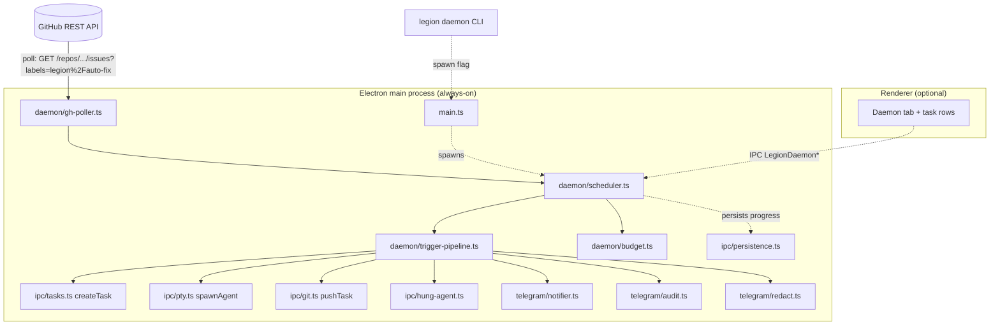

# Background Daemon — Self-hosted Devin

## 1. Problem Statement

Legion already dispatches AI agents in parallel git worktrees, but every task
today starts from a human keystroke in the GUI (or a Telegram `/prompt`). We
want an **unattended** mode: GitHub issues labeled `legion/auto-fix` or
`legion/auto-implement` become Legion tasks automatically — branch, worktree,
agent, push, draft PR, Telegram ping — without the desktop UI being open.

This is the "self-hosted Devin" pitch: same outcome, user's own machine,
user's own API keys, free.

### Success Criteria

Concrete, observable, and gateable for the v1 ship:

1. **Latency.** A newly-labeled GitHub issue on an opted-in repo opens a draft
   PR within **10 minutes** for a 3-file change on a healthy machine
   (benchmark: ~150 LOC patch, single agent, no test suite, single tick).
2. **Safety.** With the daemon enabled but no repo opted in, **zero** branches
   are created and **zero** GitHub API write calls are issued. The daemon
   must default to inert.
3. **Liveness.** The daemon survives a 24-hour soak with at least one
   issue/hour without leaking PTYs, file descriptors, GitHub rate budget, or
   `state.json` size.
4. **Observability.** Every triggered task appears in the GUI alongside
   user-spawned tasks (same store), and every daemon decision (poll, match,
   skip, spawn, push, fail) appears in the existing audit log.
5. **Resumability.** Killing the daemon mid-task and restarting it does not
   double-spawn the same issue; the in-flight task is either resumed or
   marked failed exactly once.

### Non-Goals (v1)

- Reviewing PRs the agent opens. (Future: chained `legion/review` label.)
- Acting on PR comments (`/legion fix this`). (Future: same pipeline, new
  trigger source.)
- Multi-tenancy. The daemon is single-user, uses the user's own credentials.
- Web hooks / public ingress. Polling only — see § 4.
- Org-wide install. The daemon is per-machine.

## 2. Architecture Overview



### Decision: Daemon runs in-process, in the existing Electron main process

A new module `electron/daemon/` lives inside the same Electron process the GUI
uses. The Electron entry script accepts a `--daemon` flag (and an env var
`LEGION_DAEMON=1`) that suppresses `createWindow()` and the renderer
splash. The IPC, persistence, PTY, Telegram, redactor, audit, and hung-agent
modules all become available to the daemon for free.

#### Why not a separate Node binary that shares libs?

- `node-pty` is built against Electron's Node ABI (see `asarUnpack` and
  `scripts/fix-node-pty-spawn-helper.mjs`). A plain `node` process would need
  a second prebuild matrix and shipping path. Failure mode today: PTYs that
  silently die on macOS arm64 because the helper got the wrong code-sign.
- `state.json` is opened by `persistence.ts` with no advisory file lock. Two
  processes writing it (GUI + daemon) would race and corrupt the renderer's
  store. SQLite-style locking is out of scope.
- `safeStorage` for the Telegram token (`telegram/store.ts`) is an Electron
  API, not a Node one. A second process couldn't reuse the token without
  reimplementing the OS-keyring layer.
- `cloudflared` and the Telegram tunnel owner-set in `telegram/tunnel.ts` are
  per-process. Two processes would dueling-restart the tunnel after
  `powerMonitor.resume`.

#### Why not a hidden Electron window?

A `BrowserWindow` adds a renderer and a Chromium tab for nothing. We don't
need DOM. The Electron _process_ (main only) is enough — `mainWindow` stays
null in daemon mode.

#### Single-instance lock

The daemon and the GUI must not both run. We adopt Electron's
`app.requestSingleInstanceLock()`. If the GUI is already running and the user
runs `legion daemon start`, the CLI sends an IPC message to the running
instance asking it to enable daemon-mode polling (no second process). If
nothing is running, the CLI launches the Electron binary with `--daemon`.

When the user later opens the desktop UI: same single instance, daemon
already running, GUI just attaches.

### Module Layout (new)

| File                                  | Responsibility                                                                                                          |
| ------------------------------------- | ----------------------------------------------------------------------------------------------------------------------- | ---- | ------ | ---------------------------------------------------------------- |
| `electron/daemon/index.ts`            | Public surface: `startDaemon`, `stopDaemon`, `getDaemonStatus`, `applyDaemonConfigUpdate`. Mirrors `telegram/index.ts`. |
| `electron/daemon/scheduler.ts`        | Owns the polling tick and the in-flight set.                                                                            |
| `electron/daemon/gh-poller.ts`        | Wraps `gh` CLI calls + parses issues + ETag/`If-Modified-Since` caching.                                                |
| `electron/daemon/trigger-pipeline.ts` | Issue → branch → worktree → agent → push → PR. State machine with persisted checkpoints.                                |
| `electron/daemon/budget.ts`           | Per-task and per-day budget guards (wall-clock + token estimate + spawns).                                              |
| `electron/daemon/config.ts`           | Coerces `daemon` block out of `state.json`, mirrors `telegram/config.ts`.                                               |
| `electron/daemon/store.ts`            | Per-issue ledger (issue-id → run state) inside `userData/daemon-ledger.json`.                                           |
| `electron/daemon/types.ts`            | Public types.                                                                                                           |
| `electron/daemon/cli.ts`              | `legion daemon start                                                                                                    | stop | status | tail`entry, invoked when Electron is started with`--daemon-cli`. |

## 3. Trigger Pipeline (State Machine)

Each labeled issue moves through a deterministic state machine. The current
state is persisted in `daemon-ledger.json` after every transition.

```
NEW ─ poll match ──> ACCEPTED ─ budget ok ──> WORKTREE_CREATED
                          │
                          └─ allow-list deny / dry-run ──> SKIPPED

WORKTREE_CREATED ─ spawnAgent ──> AGENT_RUNNING
AGENT_RUNNING ─ idle detector hit ──> AGENT_DONE
AGENT_RUNNING ─ wallclock > cap ──> AGENT_TIMED_OUT
AGENT_RUNNING ─ hung-agent ──> AGENT_HUNG (one nudge, then TIMED_OUT)
AGENT_DONE ─ tests configured? ──> TESTS_RUNNING ──> TESTS_OK | TESTS_FAILED
AGENT_DONE | TESTS_OK ─ push ──> PUSHED ─ gh pr create --draft ──> PR_OPENED
PR_OPENED ─ telegram notify ──> DONE

* TESTS_FAILED, AGENT_TIMED_OUT, push-conflict, redaction-tripped ──> FAILED
```

Transitions are **idempotent**: on restart we replay from the last persisted
state. `WORKTREE_CREATED` reuse the existing worktree; `PUSHED` does not
re-push; `PR_OPENED` does not re-open.

### Branch Name Derivation

`legion/auto/<issue-number>-<slug-of-title>` (slug rules reuse
`electron/ipc/tasks.ts#slug`, 72 chars).

Collisions with an existing branch ⇒ append `-r<n>` and audit it.

### Prompt Synthesis

The agent receives a single composed prompt of the form:

```
You are operating on GitHub issue #<n> in <owner>/<repo>.

Title: <title>

Body:
<body>

Recent comments (oldest first):
<comments concatenated, body-only>

Instructions:
- Make the smallest change that fully addresses the issue.
- When done, exit cleanly without further prompts.
- Do NOT run `git push` or `gh pr create`; Legion handles publishing.
```

Comments are fetched **only from allow-listed authors** (see § 5) to defeat
issue-comment prompt-injection from drive-by contributors.

### Agent Choice

Resolution order:

1. Per-repo override in `.legion-code/daemon.yml` (`agent: claude-code`).
2. Global `daemon.defaultAgent` in `state.json`.
3. Fall back to `claude-code` (matches `electron/ipc/agents.ts` default).

The agent must be `available: true` per `listAgents()` at trigger time; if
not, the task transitions to `FAILED` with reason `agent-unavailable` and
notifies via Telegram.

### Done-Detection

Reuse the existing `IdleDetector` (`electron/telegram/idle.ts`). The daemon
treats "agent idle for N seconds with non-empty diff" as "done". Default
N = 90s, configurable per repo. This is the same heuristic that already
powers the Telegram "looks done" push.

### Tests (optional)

If `.legion-code/daemon.yml` defines `test_cmd`, the daemon runs it from the
worktree after `AGENT_DONE`. Stdout/stderr go through `redact()` before
being captured into the audit detail. Failure routes to `TESTS_FAILED`,
which still opens the PR (as a draft, with the failure body) — review-time
debugging is more useful than a silent skip.

### Push & PR

- Push uses the existing `pushTask()` (`electron/ipc/git.ts`). No new code
  path.
- PR creation calls `gh pr create --draft --base <main> --head <branch>
--title "<title> (#<issue>)" --body <body>`. Body includes:
  - `Closes #<issue>` (so merging auto-closes).
  - A "Generated by Legion daemon" footer **without** model branding (per
    `CLAUDE.local.md`).
  - The agent's final diff stats (files/lines).
- Body is run through `redact()` first.

## 4. GitHub Integration

### Polling, not Webhooks (MVP)

We poll for two reasons:

- No public URL. Users on residential ISPs would need cloudflared again, and
  cloudflared tunnels die on resume (already painful for Telegram). Webhooks
  on a flaky URL aren't more reliable than polling.
- The user already has `gh` in PATH (the PR-checks watcher depends on it),
  and `gh` solves auth for us — no OAuth dance, no GitHub App to install.

**Poll cadence:** every **60s** when one or more opted-in repos exists, with
ETag + `since=<lastPollAt>` query-string compression. Backs off to 5 min
after 3 consecutive 5xx or 403 rate-limit responses.

**Endpoint:**

```
GET /repos/{owner}/{repo}/issues?labels=legion%2Fauto-fix,legion%2Fauto-implement&state=open&since=<iso>&sort=updated&direction=asc
```

We use `gh api` (not raw `fetch`) so the daemon inherits whatever auth the
user already configured (PAT, gh-app, ssh-key tied gh, enterprise host).
This matches the precedent in `pr-checks.ts`.

### Why two labels?

- `legion/auto-fix` → "small, bug-shaped, just do it" (default budget,
  draft PR).
- `legion/auto-implement` → "larger work, please surface". Adds **mandatory
  Telegram tap-to-approve before push** even if `confirmBeforePush` is off
  globally.

Both labels are namespaced (`legion/…`) so they coexist with whatever else
the repo uses.

### Auth

Resolution order:

1. `gh` CLI (preferred — already authenticated, scopes correct).
2. `GH_TOKEN` / `GITHUB_TOKEN` env var (the only env vars we look at).
3. Otherwise the daemon refuses to start and surfaces `auth-missing`.

We do **not** ship a PAT input field in the GUI v1. Users who don't have
`gh` are pointed at `gh auth login`. This mirrors the PR-checks disablement
pattern (`disabledReason: 'auth' | 'missing'`).

### Org/Repo Allow-List

Two layers, both required:

1. **Per-repo opt-in.** A file `.legion-code/daemon.yml` must exist in the
   repo's default branch with `enabled: true`. Without the file the daemon
   ignores the repo entirely. This is the exact "consent lives in the
   subject of consent" model that `telegramOptIn` on a project uses.
2. **Global allow-list.** `daemon.repos` in `state.json` lists
   `<owner>/<repo>` strings the user has opted that machine into watching.

The intersection wins. A repo on the global list without `.legion-code/daemon.yml`
is still inert. A repo with the file but not on the global list is still
inert. **Both** must agree.

## 5. Safety Model

This is the section that can shut the feature down at any review. Default
posture: **fail closed**.

### S1. Per-repo opt-in (mirrors Telegram per-project opt-in)

See § 4. Without `.legion-code/daemon.yml` _and_ `state.json` entry, nothing
happens. The renderer surfaces a one-click "opt this repo in" button that
writes both.

### S2. Author allow-list — defeats comment-injection

Only issues authored by users on `daemon.authorAllowList` (e.g.
`["truongducthang"]`) trigger a run. Comments from non-allow-listed users
are **stripped from the prompt** before synthesis. Empty allow-list ⇒ no
issues match ⇒ daemon is inert.

This is the single biggest delta from naive "self-hosted Devin" pitches:
a drive-by attacker who can comment on an issue cannot inject a prompt
into a maintainer's agent.

### S3. Budget caps (multi-axis, all enforced before spawn)

| Knob                      | Default | Where enforced                           |
| ------------------------- | ------- | ---------------------------------------- |
| `maxRunsPerDay`           | 20      | `budget.ts` (resets at local midnight)   |
| `maxConcurrent`           | 2       | `scheduler.ts` in-flight set             |
| `maxWallclockMs` per task | 20 min  | `trigger-pipeline.ts` watchdog           |
| `maxOutputBytes` per task | 4 MB    | `pty.ts` scrollback inspection           |
| `maxFilesChanged`         | 25      | git diff after `AGENT_DONE`, before push |
| `maxLinesChanged`         | 800     | git diff after `AGENT_DONE`, before push |

A breach routes to `FAILED` and notifies Telegram. No silent skips.

### S4. Loop / hung detection

We reuse `electron/ipc/hung-agent.ts` as-is. Daemon-spawned agents
participate in the same tick. On `hung` the daemon nudges once (via the
existing `nudgeAgent`), then on a second `hung` event escalates to `kill +
FAILED`.

### S5. Redaction on every outbound surface

- PR title & body: `redact()` before `gh pr create`.
- PR comments (if we add any in v1): `redact()`.
- Telegram messages: existing `Notifier` already redacts.
- Audit log `detail` field: redacted summaries only (existing rule).

The base patterns in `telegram/redact.ts` already cover AWS keys, GH PATs,
`sk-…` bearers, JWTs, and `KEY|TOKEN|SECRET|PASSWORD` assignments. We add
user patterns from `daemon.redactPatterns` (separate list from Telegram's
so a user can be looser for chat but stricter for public PRs).

### S6. `confirmBeforePush` (Telegram tap-to-approve)

When set, the pipeline halts at `AGENT_DONE` and the daemon DMs the allowed
Telegram chat with the diff stat + first 50 redacted lines of `git diff
--stat`. Inline `✅ Push` / `❌ Discard`. Reuses
`telegram/inline.ts`'s callback infrastructure.

This is **forced on** for the `legion/auto-implement` label regardless of
the global toggle.

### S7. Dry-run mode

`daemon.dryRun: true` makes the daemon do everything _except_
`pushTask` and `gh pr create`. The audit log captures what _would_ have
happened. The worktree is left in place for the user to inspect locally.

This is the mode we ship enabled-by-default on first install.

### S8. Branch protection awareness

Before push, we `gh api repos/{owner}/{repo}/branches/<main>/protection`
and refuse to push if the branch is protected **without** the
"Restrict who can push" exception covering the authenticated user. This
prevents a noise loop where every push gets rejected.

## 6. Failure Modes (table)

Each row is a thing that **will** happen unattended, and the v1 response:

| Failure                                   | Detection                                       | Response                                                                                                                                                                                     |
| ----------------------------------------- | ----------------------------------------------- | -------------------------------------------------------------------------------------------------------------------------------------------------------------------------------------------- |
| Agent compiles broken code                | `test_cmd` exits non-zero (if configured)       | Open draft PR with `[CI: tests failed]` prefix; notify Telegram.                                                                                                                             |
| Agent never settles (chatty loop)         | Wallclock > `maxWallclockMs`                    | `kill -9`, mark `AGENT_TIMED_OUT`, no push, notify.                                                                                                                                          |
| Agent silent forever                      | `hung-agent` fires `hung`                       | One nudge, then second `hung` → kill + `FAILED`.                                                                                                                                             |
| `main` advanced; branch conflicts on push | `pushTask` rejects non-fast-forward             | `rebaseTask` once; on second failure mark `FAILED` and notify with "manual rebase needed".                                                                                                   |
| Secret in diff                            | redact pattern fires on diff preview, count > 0 | Block push, mark `FAILED`, notify Telegram (without the matched bytes).                                                                                                                      |
| GH rate limited                           | `gh` exits with rate-limit text                 | Backoff to 5 min poll, surface in status, do not retry until reset header passes.                                                                                                            |
| Machine reboot mid-task                   | Ledger entry stays at `AGENT_RUNNING`           | On startup, every `AGENT_RUNNING` older than `maxWallclockMs` → `FAILED`. Younger → `FAILED` (we don't auto-resume agent PTYs across reboots in v1; the worktree is preserved for the user). |
| `gh` not installed                        | `ENOENT` on first call                          | Daemon refuses to start, status reports `disabledReason: missing`.                                                                                                                           |
| Two issues for the same branch slug       | Ledger key collision check at `ACCEPTED`        | Append `-r<n>` to branch, audit.                                                                                                                                                             |
| Tunnel/Telegram down when notifying       | Notifier already handles                        | Daemon does not block the pipeline on notification failure.                                                                                                                                  |
| Repo deleted between poll and spawn       | `gh api` 404 at any step                        | Drop from active set, log once, continue.                                                                                                                                                    |
| `.legion-code/daemon.yml` becomes invalid | YAML parse fails                                | Treat as opted-out, log warning, do **not** notify (avoids noise loops on bad commits).                                                                                                      |

## 7. GUI Integration

The daemon is in the same process as the GUI when the renderer is open, so
mirroring is a SolidJS store update, not IPC plumbing.

- Daemon-spawned tasks live in the **same `tasks` map** the renderer
  already shows. They get a small badge (`Daemon`) to distinguish them.
- A new **Daemon** tab in the existing settings drawer hosts:
  - global enable toggle (defaults `false`)
  - per-repo opt-in list + "add current repo"
  - budget knobs
  - author allow-list
  - dry-run toggle
  - confirmBeforePush toggle
  - last-poll timestamp + status banner (same disabled/auth/missing surface
    as PR-checks)
- A new **Daemon Activity** panel (sibling to Audit Log) shows the ledger.
- Live tail of an in-flight daemon task uses the **existing** PTY
  subscribe path — no new IPC.

## 8. Configuration Surface

### Per-repo: `.legion-code/daemon.yml` (checked into the repo)

```yaml
enabled: true
agent: claude-code # optional; falls back to daemon.defaultAgent
labels: [legion/auto-fix] # optional; subset of global labels
test_cmd: npm test # optional
idle_threshold_seconds: 90 # optional
prompt_preamble: | # optional, prepended to synthesized prompt
  This repo uses pnpm, not npm.
max_files_changed: 10 # optional, tightens but cannot loosen global
```

### Per-machine: `state.json` → `daemon` block

```ts
interface DaemonConfig {
  enabled: boolean;
  defaultAgent: 'claude-code' | 'codex' | 'gemini' | 'opencode' | 'copilot';
  labels: string[]; // ['legion/auto-fix','legion/auto-implement']
  repos: string[]; // ['truongducthang/legion', ...]
  authorAllowList: string[]; // GitHub usernames
  pollIntervalSeconds: number; // default 60
  maxRunsPerDay: number; // default 20
  maxConcurrent: number; // default 2
  maxWallclockSeconds: number; // default 1200
  maxFilesChanged: number; // default 25
  maxLinesChanged: number; // default 800
  confirmBeforePush: boolean; // default false
  dryRun: boolean; // default true on first install
  redactPatterns: string[]; // separate from telegram.redactPatterns
}
```

### Per-machine: `userData/daemon-ledger.json`

Single JSON file, atomic-write pattern matching `persistence.ts`. Schema:

```ts
interface DaemonLedgerEntry {
  key: string; // `${owner}/${repo}#${issueNumber}`
  state:
    | 'NEW'
    | 'ACCEPTED'
    | 'WORKTREE_CREATED'
    | 'AGENT_RUNNING'
    | 'AGENT_DONE'
    | 'AGENT_TIMED_OUT'
    | 'AGENT_HUNG'
    | 'TESTS_RUNNING'
    | 'TESTS_OK'
    | 'TESTS_FAILED'
    | 'PUSHED'
    | 'PR_OPENED'
    | 'DONE'
    | 'FAILED'
    | 'SKIPPED';
  reason: string | null; // present on FAILED/SKIPPED
  taskId: string | null; // links into the regular tasks map
  agentId: string | null;
  branchName: string | null;
  prUrl: string | null;
  acceptedAt: number; // epoch ms
  updatedAt: number;
  issueUpdatedAt: number; // GitHub's updated_at — for re-trigger
}
```

Re-trigger rule: a `DONE`/`FAILED` entry whose `issueUpdatedAt` advances by
more than the poll interval is _not_ re-run automatically — relabel
(remove + re-add) is the explicit re-trigger gesture. This is to avoid
endless reruns on bot comments.

## 9. IPC + CLI Surface

### New IPC channels (append to `IPC` enum)

```
StartDaemon            = 'start_daemon'
StopDaemon             = 'stop_daemon'
GetDaemonStatus        = 'get_daemon_status'
SetDaemonConfig        = 'set_daemon_config'
DaemonStatusChanged    = 'daemon_status_changed'      // main → renderer push
DaemonLedgerUpdated    = 'daemon_ledger_updated'      // main → renderer push
DaemonApprovePush      = 'daemon_approve_push'        // for confirmBeforePush
DaemonDiscardPush      = 'daemon_discard_push'
```

All must be added to `electron/preload.cjs`'s `ALLOWED_CHANNELS` — main
already verifies this on startup.

### CLI

```
legion daemon start [--dry-run] [--repo owner/name]
legion daemon stop
legion daemon status
legion daemon tail [--issue owner/name#n]
```

`legion` is the same Electron binary, branched on `process.argv` early in
`main.ts`. The CLI form sets `process.env.ELECTRON_RUN_AS_NODE` and runs
`daemon/cli.ts`, which connects to the running instance via a small
Unix-socket / named-pipe RPC at `userData/daemon.sock`. If no instance is
running, it spawns one with `--daemon` and detaches.

## 10. Testing Strategy

Vitest (already in repo). Three layers:

### Unit tests

- `daemon/budget.test.ts`: every cap, off-by-one on the day boundary, reset
  on cross-midnight.
- `daemon/scheduler.test.ts`: state machine transitions, idempotency on
  replay, single-flight per issue key.
- `daemon/gh-poller.test.ts`: ETag handling, since-cursor advancement,
  rate-limit backoff.

### Integration tests (fakes, not real GitHub or PTY)

- A `FakeGhClient` returns canned issue JSON + 304/429 sequences. Validates
  the daemon does the right thing across an entire poll cycle.
- A `FakePtyHost` replaces `spawnAgent` with a callable that emits scripted
  output + a configurable exit code. Validates the trigger pipeline reads
  diff stats, decides done/timeout, pushes (against a temp git repo), and
  records ledger transitions.
- A `tmp` git repo with a "main" branch backs every push test; `pushTask`
  hits a bare repo also under `tmp`. Reuse the pattern from
  `conflict-preflight.integration.test.ts`.

### Soak test (manual, gated, not in CI)

24-hour run against a private test repo with a script that opens
1 issue/hour with the trigger label. Assertion: no FD leak, no
state.json bloat, no orphan PTYs at end. Add to `docs/superpowers/` as
a checklist for releases.

## 11. Alternatives Considered

### A. GitHub Actions runner emulation

Spin up a self-hosted Actions runner labeled `legion`, drive it via
workflow files that call into a Legion-provided action. **Tradeoff:** push
into a familiar GH primitive, ecosystem benefits. **Why rejected:** the
runner runs _inside_ GH's sandbox, but our agents need the user's local
state (gh-auth, ssh keys, node-pty, claude CLI). Bridging that out of the
runner sandbox is fragile, and the local-machine pitch dies the moment we
need a public webhook.

### B. Pure GitHub Action that calls a local cloudflared webhook

A repo-owned workflow listens for the label and POSTs a webhook to the
user's machine via cloudflared. **Tradeoff:** simpler — GH does the polling
for you. **Why rejected:** cloudflared tunnels are already a known
liveness problem in this app (the `powerMonitor.resume` handler in
`main.ts` exists specifically because they die). Building the daemon's
correctness on top of that is a bad foundation. Polling is boring and
boring is good here.

### C. Hybrid — GH Action triggers local via Telegram

Workflow file in repo posts a message to the user's Telegram bot, the bot
treats it as a `/prompt`. **Tradeoff:** reuses Telegram fully. **Why
rejected:** Telegram is for the human, not for machines. Using it as a
control plane breaks the audit-log assumption that every Telegram
event has a human in the loop, and pollutes the rate limiter.

We pick **local daemon + polling** (this doc). It's the simplest thing
that meets the pitch.

## 12. Open Questions

1. **Issue body markdown vs raw.** GitHub stores issue bodies with GFM. Do
   we feed the agent the rendered text or the markdown? (Lean: markdown —
   agents are good at it, and links survive.)
2. **What happens when the user opens the GUI mid-task?** The task already
   shows up (shared store). But the PTY scrollback was captured headless —
   how much do we replay? Probably "last 50 lines, then live" matching
   `pty.ts`'s existing attach-existing path, but it's worth a spike.
3. **Branch-protection probe cost.** One `gh api` per push per opt-in repo.
   Worth caching for 24h? Or do we accept the cost as one-per-task?
4. **Per-issue vs per-machine ledger.** Today the ledger is per-machine.
   If two users on two machines opt the same repo into their daemons,
   they will race on the label. Do we add a "claim" comment on the issue
   to debounce? (Probably yes, but is it v1?) Tentative answer: out of
   scope v1, document the foot-gun, single-user assumption holds.
5. **GitHub App vs gh CLI for v2.** A real GitHub App would let us scope
   permissions per-repo, surface in the GH UI as "Legion has access to X",
   and let us optionally accept webhooks. Worth the install friction? Defer
   to v2; gh-CLI is plenty for "self-host" pitch.
6. **What does `--dangerously-skip-permissions`-style flag mean for the
   daemon?** Each agent has one (see `electron/ipc/agents.ts`). The
   daemon's whole point is unattended runs, but we don't want a malicious
   issue body to execute `rm -rf`. Lean: the daemon passes
   `skip_permissions_args` only when `agent.allow_unattended === true`
   in the global config, defaulting OFF. Document the trade-off loudly in
   the Daemon tab.
7. **What's the failure mode when the user's API key (Anthropic/OpenAI)
   hits its rate limit mid-run?** Today the agent CLI prints an error and
   exits non-zero. The daemon should detect the exit code, mark `FAILED`
   with reason `provider-rate-limit`, and back off for the issue (not
   re-retry the same issue until relabeled). Confirm by inspecting each
   CLI's actual exit semantics — not investigated in this doc.
